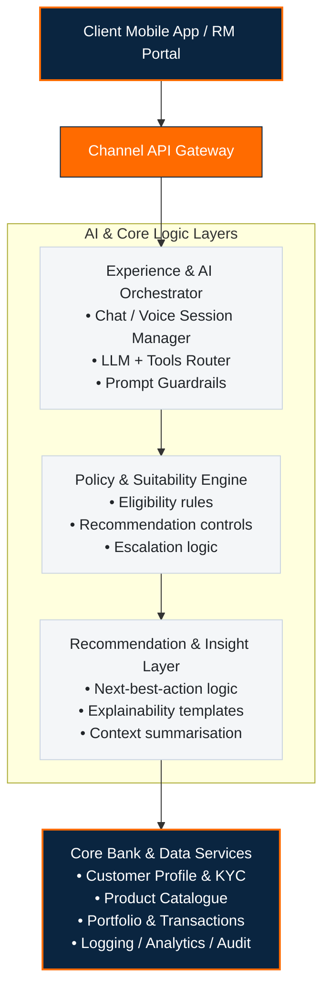

# AI Wealth Copilot Prototype
**Track 1: Digital Wealth Management**

> **Disclaimer:** This is an independent prototype created for demonstration purposes. It is not an official product of, and is not affiliated with or endorsed by, any bank.

AI Wealth Copilot Prototype is a guardrailed digital wealth adviser designed as an independent digital wealth advisory prototype for regulated banking use cases. It combines customer goals, behavioural signals, affordability, and suitability controls to generate explainable recommendations while escalating complex or regulated cases to certified Relationship Managers.

## Problem Statement
This project addresses a digital wealth management hackathon challenge focusing on building a digital wealth management experience that can serve a broad customer base through the mobile channel while preserving suitability, multilingual access, explainability, and human oversight for regulated advice.

Traditional wealth journeys are either relationship-manager heavy, difficult to scale, or too generic to drive customer trust and conversion. The opportunity is to create a hybrid advisory model where AI improves reach and responsiveness without bypassing compliance, product-fit logic, or expert review.

## Solution Overview
AI Wealth Copilot is built as a **workflow-driven advisory copilot**, not a generic chatbot. It captures customer intent, financial goals, liquidity requirements, existing investment posture, and behavioural signals, then routes this context through a policy and suitability engine before generating customer-visible recommendations.

The proposed model follows a **human-in-the-loop** design:
- AI handles multilingual onboarding, goal discovery, financial education, and first-level product guidance.
- A suitability layer enforces recommendation constraints before advice is shown.
- Complex, ambiguous, or regulated journeys are escalated to Relationship Managers with a structured summary.

This makes the system useful across retail and mass-affluent segments while still keeping certified advisors in control of high-risk or regulated decision points.

## Why This Is Different
### Not a generic LLM assistant
Most AI banking demos stop at a conversational interface. AI Wealth Copilot adds explicit workflow states, eligibility checks, recommendation reasoning, and RM escalation paths.

### Explainability-first by design
Recommendations are produced as reason cards that can explain:
- Goal fit
- Risk fit
- Product fit
- Liquidity fit
- Why a human review was triggered, if applicable

### Deployment-ready architecture
The architecture separates:
- customer experience,
- AI orchestration,
- policy enforcement,
- recommendation logic, and
- core banking integrations.

That separation makes the solution easier to pilot in sandbox, then move into an internal cloud or on-prem environment.

## Key Features
- **Goal-based onboarding** – Captures short-term and long-term goals, time horizon, liquidity preferences, dependents, and existing investments through a conversational journey.
- **Risk profiling and segmentation** – Combines KYC, age band, income pattern, affordability, and behavioural indicators to derive risk bands.
- **Product suitability engine** – Maps products such as mutual funds, deposits, bonds, and insurance to customer context using guardrailed recommendation logic.
- **Multilingual interaction** – Supports multilingual text and voice experiences for pan-India usage (English, Hindi, Marathi, Gujarati).
- **RM escalation workflow** – Flags regulated or complex cases and routes them to Relationship Managers with a context summary.
- **Explainable recommendation cards** – Shows rationale rather than opaque product pushes.
- **Audit trail and compliance logging** – Persists prompts, rule decisions, recommendation outputs, and approval actions.
- **Event-driven nudges** – Supports reminders such as missed SIPs, idle cash opportunities, and milestone-based follow-ups.
- **Advisor cockpit (future extension)** – Gives RMs a queue, prioritization view, rationale review, and engagement workflow.

## End-to-End Flow
1. **Customer login and consent**  
   The user opens the mobile app and opts into the Wealth Copilot journey.

2. **Profile and goal capture**  
   The assistant collects goals, horizon, liquidity needs, dependents, risk appetite indicators, and current investments.

3. **Risk and suitability computation**  
   The policy layer computes a risk band and filters eligible products.

4. **Recommendation generation**  
   The AI orchestration layer produces an explanation-backed recommendation card.

5. **RM review when required**  
   Regulated or higher-complexity journeys are escalated with full advisory context.

6. **Execution and monitoring**  
   Approved recommendations can trigger next-step journeys, follow-ups, and monitoring nudges.

## High-Level Architecture



The architecture keeps policy control and customer data within bank-governed boundaries while treating the AI layer as a controlled service that can start in sandbox and later move to enterprise deployment.

## Technology Stack
### Frontend and Experience
- HTML5, CSS3 (Vanilla design language with dark-mode controls)
- Mobile-first responsive split-screen container
- Multilingual UX templates (English, Hindi, Marathi, Gujarati)

### AI and Reasoning
- Gemini 1.5 Flash (Direct client-side NLU intent parsing and text synthesis)
- Amazon Bedrock (Production-ready Claude 3.5 Sonnet payload formats and AWS SigV4 signed header simulator)
- Prompt guardrails and explanation templates

### Backend and Integration
- Local storage & session storage credential state management
- Event-driven notifications and monitoring hooks
- Modular client-side rules engine

### Security and Compliance
- Client-side session isolation for API keys
- Consent capture and audit logging
- DPDP-aligned compliance architecture

## Demo Scenarios
### 1. New customer onboarding
A customer defines wealth goals, liquidity needs, and time horizon, then receives a guarded first recommendation.

### 2. RM escalation for a regulated case
The system detects a case that should not be completed autonomously (e.g. PMS threshold >50L) and forwards it to an RM with a concise summary.

### 3. Portfolio review and nudges
A customer receives contextual nudges for idle cash, missed investment cadence, or a periodic review.

## Performance Targets
- **First recommendation latency:** under 5 seconds for typical profile flows
- **Guardrail coverage:** 100% of customer-visible advice flows pass through the policy engine
- **Explainability depth:** at least 3 rationale pillars per recommendation
- **RM handoff efficiency:** one-click escalation with preserved context

## Repository Structure
```text
ai-wealth-copilot-hackathon-prototype/
├── README.md
├── index.html                    # Main digital wealth interface
├── app.js                        # NLU parser, suitability engine, & RM escalation logic
├── style.css                     # UI styling rules
├── data/
│   └── schemes.json              # Eligible mutual fund schemes database
├── docs/                         # Architecture, schemas, and submission materials
│   ├── submission-materials.md
│   └── architecture.md
└── tests/                        # Suitability & compliance test suite
    ├── run_tests.js
    └── suitability.test.js
```

## Running Locally

This project has zero mandatory frontend build dependencies and can be served as a static site.

### Option 1: Python

```bash
python -m http.server 8000
```

### Option 2: Node

```bash
npx serve .
```

Then open:

```text
http://localhost:8000
```

## Test Suite

Run the validation suite to test all suitability thresholds and guardrails:

```bash
node tests/run_tests.js
```

## Deployment
### GitHub Repository
https://github.com/anandkrshnn-ai/ai-wealth-copilot-hackathon-prototype

### Live Demo
https://anandkrshnn-ai.github.io/ai-wealth-copilot-hackathon-prototype/

### Demo Video
Add the final 3-minute demo link here.

## Hackathon Positioning
This project is designed to demonstrate four qualities that matter in institutional banking innovation:
- **Scalability** – AI increases advisory reach without linear RM scaling.
- **Safety** – product visibility is constrained by explicit suitability and policy checks.
- **Explainability** – outputs are understandable to customers, RMs, and governance teams.
- **Deployability** – the architecture can move from sandbox to governed enterprise rollout.

## Future Roadmap
### Near-term
- Scheme-level mutual fund recommendations
- Basic RM cockpit and queue view
- Rebalancing suggestions and review journeys

### Longer-term
- Model-risk governance workflows
- Prompt versioning and audit replay
- Fairness and performance monitoring
- Expanded support for retirement, insurance, and structured advisory journeys

## Author
**Anandakrishnan Damodaran**<br/>
Independent Builder<br/>
Chennai, Tamil Nadu

## License
MIT License
