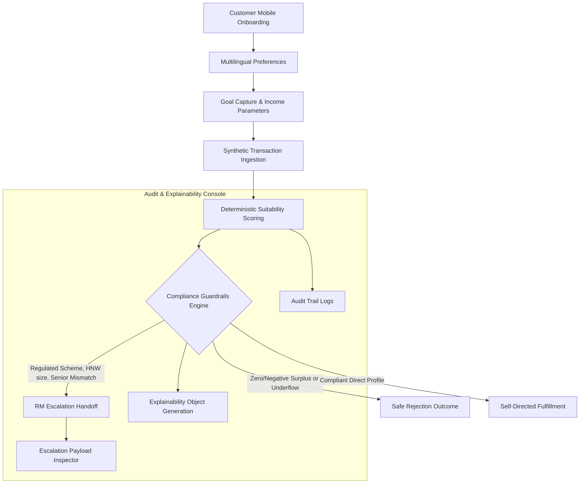

# Technical Architecture (Target AWS Sandbox Production Model) - AI Wealth Copilot Prototype

> [!NOTE]
> This document outlines the **Target cloud and logical architecture** designed for production deployment in a Secure AWS Sandbox. The current MVP PoC is a static frontend prototype leveraging client-side execution and direct Gemini APIs for judge inspection.

## Core System Architecture Flow



---

## The Formal Suitability Explainability Object

In compliance with professional auditing guidelines, every recommendation outcome generates a structured `explainabilityObject` documenting the decision trace:

```typescript
interface ExplainabilityObject {
  customer_profile_summary: string; // Sanitized metadata capture (Age, surplus)
  risk_band: "Conservative" | "Moderate" | "Aggressive";
  goal_horizon: "Short Term (< 3 Years)" | "Long Term (5+ Years)";
  product_eligibility: string; // Target code alignment checks
  reason_codes: string[];      // Active compliance block tags (e.g. SENIOR_CITIZEN_MISMATCH)
  recommendation_class: string;  // Product category (e.g. Alternatives, Equity)
  requires_rm_handoff: boolean;  // Intercept indicator
}
```

---

## Safe-Failure Logic & Rejections

To prevent poor financial outcomes or regulatory non-compliance, the engine checks for two primary direct rejection cases prior to evaluating standard matches:

1.  **NEGATIVE_SURPLUS_REJECTION:** Evaluates when monthly expenses equal or exceed income. Direct digital onboarding is blocked, and the customer is routed to financial advisory services.
    *   *UI-Safe copy:* `"Suitability assessment result: Not eligible for direct digital fulfilment. Your declared monthly expenses exceed or equal your monthly income, resulting in zero investable surplus."`
2.  **TICKET_SIZE_UNDERFLOW:** Evaluates when the customer's budget is less than the selected scheme's minimum investment threshold (e.g. trying to buy a PMS product with a ₹10,000 budget).
    *   *UI-Safe copy:* `"Suitability assessment result: Minimum investment threshold mismatch. Selected product requires minimum ₹50,000,000, but your declared budget is ₹10,000."`

---

## SEBI-Aligned Risk Calculations

The suitability engine assigns a score (0-100) combining demographic age factors, declared risk tolerances, and income surplus ratios:

| Metric Group | Criteria Range | Score Weight |
| :--- | :--- | :--- |
| **Demographic Age** | Age $\le 30$ | +30 |
| | $30 < \text{Age} \le 50$ | +20 |
| | $\text{Age} > 50$ | +5 |
| **Declared Risk** | High | +40 |
| | Medium | +25 |
| | Low | +10 |
| **Surplus Ratio** | $> 50\%$ of income | +30 |
| ($\text{Surplus} / \text{Income}$) | $25\% - 50\%$ | +20 |
| | $< 25\%$ | +10 |

---

## VPC-Protected Cloud Deployment (Scalability)

When migrating this prototype to a **secure AWS Sandbox**:
*   **Data Tier:** Migrate static JSON resources (`schemes.json`, `customers.json`) to an encrypted Amazon RDS PostgreSQL or Amazon DocumentDB instance inside a private subnet.
*   **Advisory Core:** Serve the logic via containerized API microservices hosted on AWS Fargate (ECS) behind an Application Load Balancer.
*   **GenAI Engine:** Deploy the text NLU and rationalization layer using VPC Endpoint connections to Amazon Bedrock (invoking Claude 3.5 Sonnet / Haiku), ensuring customer transaction parameters never traverse public networks.
*   **Market Data Sync:** Introduce a dedicated **Market Data Sync / Product Refresh Engine** container within the private subnet.
    *   *Polling Cadence:* Configured for daily end-of-day (EOD) synchronization of Mutual Fund NAVs and weekly audits of structured products.
    *   *Source Systems:* Connects via secure HTTPS endpoints to external AMFI NAV feeds and Mutual Fund Utility APIs.
    *   *Integration State:* In the current MVP prototype, this sync is simulated using static configuration files (`data/schemes.json`). In production, this container runs as a scheduled job triggered by Amazon EventBridge / ECS Scheduled Tasks executing CDC (Change Data Capture) updates into the Amazon RDS instance.
